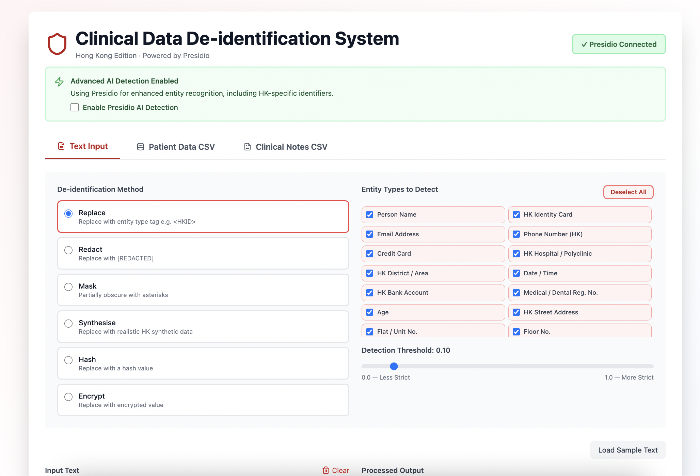
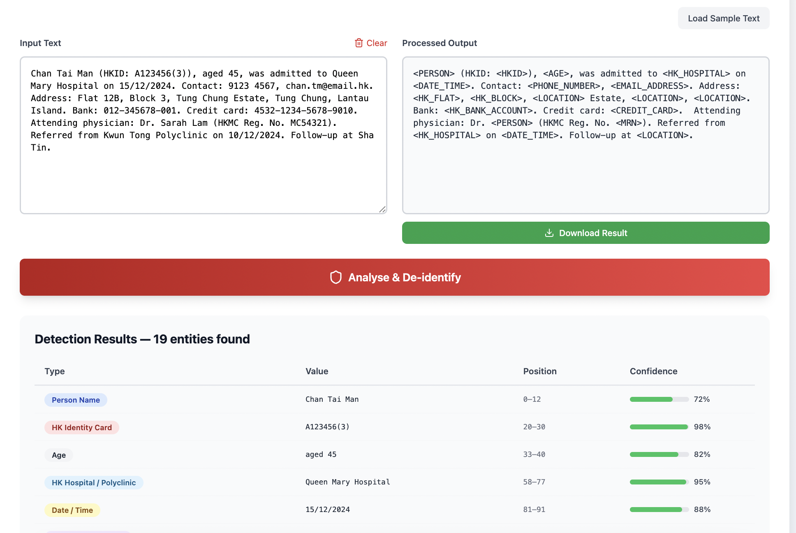

# Medical Data Anonymization for Secure Model Training

## Project Overview

This system is designed to help healthcare researchers and administrative staff anonymize both unstructured clinical text and structured CSV datasets without needing programming knowledge. It supports side-by-side preview of original and anonymized results, configurable de-identification methods, selectable entity types, and export of processed output in `.txt` or `.csv` format.

### Key Features

- React-based frontend for text input, CSV upload, preview, and downloads.
- Flask backend exposing REST APIs for health check, entity analysis, and anonymization.
- Hybrid de-identification pipeline combining rule-based detection with Microsoft Presidio.
- Support for multiple anonymization methods: replace, redact, synthesize, mask, hash, and encrypt.
- Support for both free-text clinical notes and CSV-based medical datasets.

## Tech Stack

### Frontend

- React.js
- JavaScript Fetch API for backend communication.

### Backend

- Python 3.11.4
- Flask
- Microsoft Presidio

## Repository Structure

```bash
.
├── src/                 # React frontend source files
├── public/              # React public assets
├── pii-backend/         # Flask backend
│   ├── app.py
│   ├── requirements.txt
│   └── ...
├── package.json
└── README.md
```

> The exact file structure may vary slightly, but the frontend runs from the project root and the backend runs from the `pii-backend` directory.

## Installation

### Prerequisites

Make sure the following are installed:

- Python 3.11.4
- npm 11.6.0
- Git

### 1. Clone the repository

```bash
git clone https://github.com/ellawong0812/Clinical-Data-Deidentification-System.git
cd Clinical-Data-Deidentification-System
```

### 2. Install frontend dependencies

From the project root:

```bash
npm install
```

### 3. Install backend dependencies

Open a second terminal and run:

```bash
cd pii-backend
pip install -r requirements.txt
```

## Running the Project

The frontend and backend must be started in separate terminals.

### Terminal 1: Start the backend

```bash
cd Clinical-Data-Deidentification-System/pii-backend
python app.py
```

When the backend starts successfully, it will be available at:

- `http://localhost:5001`

### Terminal 2: Start the frontend

```bash
cd Clinical-Data-Deidentification-System
npm start
```

When the frontend starts successfully, it will be available at:

- `http://localhost:3000`

## API Summary

The Flask backend exposes three main endpoints:

- `GET /api/health` — checks backend availability.
- `POST /api/analyze` — detects entities from input text using selected entities and threshold settings.
- `POST /api/anonymize` — anonymizes text using the selected method and returns processed output.

## Usage

1. Start both the backend and frontend servers.
2. Open the frontend in the browser at `http://localhost:3000`.
3. Enter clinical text manually or upload a CSV file.
4. Choose the anonymization method, entity types, and detection options.
   
5. Process the data and review the original versus anonymized output.
6. Download the anonymized results as `.txt` or `.csv`.
   
